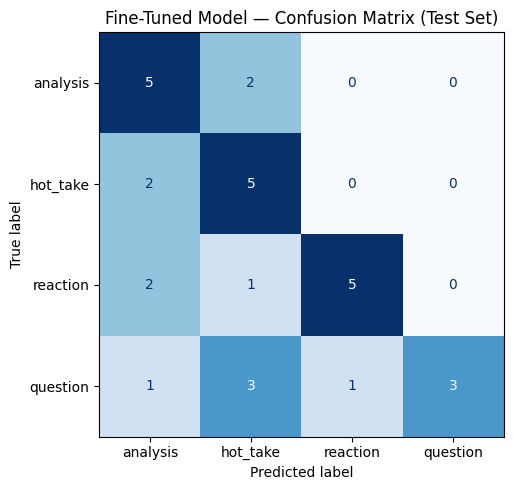

# TakeMeter

Fine-tuned **DistilBERT** classifier for [r/leagueoflegends](https://www.reddit.com/r/leagueoflegends/) posts. Each post gets one of four labels: `analysis`, `hot_take`, `reaction`, or `question`. The model is compared against a **Groq zero-shot baseline** (`llama-3.3-70b-versatile`) on a locked test split.

**Dataset:** `data/labeled_posts_export.csv` (200 rows)  
**Training notebook:** `ai201_project3_takemeter_starter_clean.ipynb` (Google Colab, T4 GPU)  
**Local fallback:** `python scripts/run_evaluation.py` (optional; Colab is primary)

---

## Demo Video

[TakeMeter demo — Colab classifications & evaluation walkthrough](https://jam.dev/c/cfcea79d-ee87-47ea-a0f3-7467e7eb09e4)

---

## Labels

Four mutually exclusive labels based on **text content only** (not upvotes or flair).

| Label | Definition |
|-------|------------|
| `analysis` | Explains, argues, or reports using game knowledge, mechanics, patch context, stats, links, or step-by-step reasoning. |
| `hot_take` | Bold opinion, complaint, or nostalgia claim with little supporting evidence; asserts rather than argues. |
| `reaction` | Personal moment, emotion, or low-stakes share without primarily asking for advice (rank milestones, vents, polls). |
| `question` | Main purpose is asking for advice, recommendations, or factual information from the community. |

**Mutual exclusivity (quick rules):**

| If the post… | Label |
|--------------|-------|
| Cites stats, patch notes, ability interactions, or linked proof | `analysis` |
| Strong claim with accusatory/nostalgic framing and no real evidence | `hot_take` |
| Shares a personal moment or vent without seeking advice | `reaction` |
| Asks for help, champ picks, or factual answers | `question` |

Full definitions, examples, and edge-case rules are in [`planning.md`](planning.md).

---

## Data Collection

**Community:** r/leagueoflegends — high volume of text posts covering patches, ranked, esports, and player culture.

**Sources:**

| Source | Content | Approx. count |
|--------|---------|---------------|
| old.reddit.com **hot** + **new** self-posts | Title + body | ~120 |
| Top comments on discussion threads | Substantive replies (50+ chars) | ~50 |
| Patch / esports threads | Mechanics notes and news | ~30 |

**Method:** Reddit blocks server-side scraping, so posts were collected via **browser JSON export** (`scripts/collect_in_browser.js` on old.reddit.com) and stored with permalinks in the `source_url` column. Only public English self-posts and comments; skipped promos, `[removed]`, and pure link posts.

**Output columns:** `text`, `label`, `notes`, `source_url`

---

## Labeling Process

1. **Browser collection** — posts gathered from old.reddit.com into JSON, then merged into the CSV with manual label assignment.
2. **Review GUI** — `python scripts/review_gui.py` loads flagged rows; keys 1–4 assign labels; **Save + apply** writes back to `labeled_posts_export.csv`.
3. **Rebalance (partial)** — `scripts/rebalance_dataset.py` swapped overrepresented `question` rows for new pool posts where candidates existed; replacement rows were re-reviewed in the GUI.
4. **Every row reviewed** — final labels are human decisions against the rules in `planning.md`, not bulk auto-accept.

**Label distribution (200 rows, after rebalance + GUI review):**

| Label | Count | % |
|-------|------:|--:|
| `analysis` | 45 | 22.5% |
| `hot_take` | 49 | 24.5% |
| `reaction` | 50 | 25.0% |
| `question` | 56 | 28.0% |

No label exceeds 70%. We rebalanced toward 50 each using `scripts/rebalance_dataset.py` and a fresh analysis post pool, then corrected swapped rows in the review GUI (69 rebalance rows reviewed). Final counts drift slightly from 50/50 because manual fixes moved borderline posts (e.g. auto-tagged `analysis` → `question`) — intentional for label accuracy.

**Train / val / test split:** 70% / 15% / 15%, stratified, `random_state=42` → 140 / 30 / 30.

---

## Difficult Labeling Cases

Three posts that required careful edge-case rules (full table in `planning.md`):

| # | Snippet | Considered | Final | Why |
|---|---------|------------|-------|-----|
| 1 | i0ki Vayne drama with u.gg link and 0/9/1 counter-evidence | `analysis`, `hot_take` | `analysis` | Main work is fact-checking with verifiable match history, not just asserting. |
| 2 | "Why is K'Sante considered pro jailed?" + ability-by-ability breakdown | `question`, `analysis` | `analysis` | Rhetorical title; body builds a design argument, not advice-seeking. |
| 3 | "Hit plat now feel flat… what's your why?" | `reaction`, `question` | `reaction` | Personal milestone + motivation share; community reflection, not climb advice. |

---

## Training Pipeline

| Item | Choice |
|------|--------|
| **Platform** | Google Colab (free T4 GPU) |
| **Base model** | `distilbert-base-uncased` (Hugging Face Transformers) |
| **Notebook** | `ai201_project3_takemeter_starter_clean.ipynb` |

### Hyperparameters

These values were chosen by **empirical tuning on Colab**, not from BERT defaults alone. With only **140 training examples**, the usual Hugging Face starting point (`2e-5`, 3 epochs) underperformed; we tried gentler and more aggressive settings until val and test both improved.

**Tuning history (same locked split, `random_state=42`):**

| Config | Val accuracy | Test accuracy | Notes |
|--------|-------------:|--------------:|-------|
| `2e-5`, 3 epochs | — | ~40% | Starter default; poor generalization on small data |
| `1e-6`, 3 epochs | 66.7% | 46.7% | Stable (no class collapse) but underfit |
| **`1e-4`, 5 epochs** | **73.3%** | **60.0%** | **Final config** — first run to beat Groq (+3.3 pp) |

| Setting | Value | Why |
|---------|-------|-----|
| Learning rate | **`1e-4`** | **`2e-5`** (standard BERT fine-tune) was too slow to adapt on 140 posts (~40% test). **`1e-6`** was stable but underfit (66.7% val / 46.7% test). **`1e-4`** is 100× higher than `1e-6` — aggressive for BERT, but it converged faster on Colab T4 and transferred best to the locked test set. |
| Epochs | **5** | Notebook default is 3; val accuracy was still rising at epoch **5** (66.7% → **73.3%**), with val loss still falling — no obvious overfit. Stopped at 5 rather than pushing further on a 200-row dataset. |
| Checkpoint | `load_best_model_at_end=True`, `metric_for_best_model="accuracy"` | Saves best val epoch (**5**, **73.3%** val acc on T4). |
| Batch size | 16 (train), 32 (eval) | Fits T4 GPU; reduce train batch to 8 if OOM. |
| Max sequence length | 256 tokens | Covers most Reddit title+body posts after truncation. |
| Optimizer | AdamW, weight decay 0.01, warmup 50 steps | Notebook defaults. |

**Validation (Colab T4, 30-example val set, `random_state=42`, `lr=1e-4`):**

| Epoch | Train loss | Val loss | Val accuracy |
|------:|-----------:|---------:|-------------:|
| 1 | — | 1.359 | 30.0% |
| 2 | 1.374 | 1.298 | 26.7% |
| 3 | 1.307 | 1.111 | 66.7% |
| 4 | 1.148 | 0.977 | 66.7% |
| 5 | 0.875 | 0.794 | **73.3%** |

Early epochs are noisy on a 30-row val split; loss and accuracy trend up through epoch 5 on Colab. **`1e-4`** learns faster per step; **5 epochs** gives that rate enough passes over 140 examples to converge without pushing into obvious overfitting.

**Run on Colab:** Upload `labeled_posts_export.csv`, set `GROQ_API_KEY`, run Sections 1–6, download `evaluation_results.json` and `confusion_matrix.png`.

---

## Baseline Comparison

**Approach:** Zero-shot classification with Groq **`llama-3.3-70b-versatile`**. Same 30-example test set as the fine-tuned model (`random_state=42` stratified split). One API call per test post, `temperature=0`, 0.1s delay between requests.

**Prompt summary:** The system prompt names r/leagueoflegends, defines all four labels in plain language with one example each, lists edge rules from `planning.md` (stat-one-liner → likely `hot_take`; kit walkthrough arguing a design point → `analysis` not `question`), and instructs the model to respond with **only** the label string (`analysis`, `hot_take`, `reaction`, or `question`). Full prompt is in notebook Section 5.

**Parsing:** Output is lowercased and matched to `LABEL_MAP`; unparseable responses are excluded from baseline accuracy (tracked separately).

---

## Evaluation

Metrics from **`evaluation_results.json`** and **`confusion_matrix.png`**, exported from **Google Colab** (`ai201_project3_takemeter_starter_clean.ipynb`, Sections 4–6) on the locked test split (`random_state=42`, 140 / 30 / 30). Training: **5 epochs**, **`learning_rate=1e-4`**, **73.3%** val / **60.0%** test accuracy.

### Overall accuracy

| Model | Test accuracy | Macro F1 | Notes |
|-------|---------------|----------|-------|
| Zero-shot baseline (Groq) | **0.567** (56.7%) | 0.56 | 30/30 parseable (`llama-3.3-70b-versatile`) |
| Fine-tuned DistilBERT | **0.600** (60.0%) | 0.60 | 18/30 correct; Colab Section 4 test eval |
| vs baseline | **+0.033** | | Above Groq; below +10 pp stretch goal |

Both models beat random guessing (25%). Fine-tuned **macro F1 (0.60)** meets the planning.md target; **`reaction`** and **`hot_take`** F1 now beat Groq. **`question`** recall is weakest (38%).

### Per-class F1 comparison

| Label | Groq F1 | Fine-tuned F1 | Support |
|-------|---------|---------------|--------:|
| `analysis` | 0.50 | **0.59** | 7 |
| `hot_take` | 0.50 | **0.56** | 7 |
| `reaction` | 0.53 | **0.71** | 8 |
| `question` | **0.71** | 0.55 | 8 |

Fine-tuned wins on **`analysis`**, **`hot_take`**, and **`reaction`**; Groq wins on **`question`**.

### Confusion matrix



Fine-tuned test set: **18/30 correct (0.600)**. Diagonal = correct; off-diagonal = mislabels.

| True ↓ / Pred → | `analysis` | `hot_take` | `reaction` | `question` |
|-----------------|-----------:|-----------:|-----------:|-----------:|
| `analysis` | **5** | 2 | 0 | 0 |
| `hot_take` | 2 | **5** | 0 | 0 |
| `reaction` | 2 | 1 | **5** | 0 |
| `question` | 1 | 3 | 1 | **3** |

Largest off-diagonal block: **`question` → `hot_take`** (3). The model never predicts `question` for true `analysis`, `hot_take`, or `reaction` posts (zero in the `question` column except the diagonal).

### Sample Classifications

Five examples from the **Colab Section 4** test run (60.0% accuracy). Confidence = softmax probability for the predicted class.

| Post (excerpt) | True label | Predicted | Confidence | OK? |
|----------------|------------|-----------|------------|-----|
| **Ekko/Pantheon Interaction** — "Ekko Q cannot proc the passive during Pantheon E… tried in practice tool…" | `analysis` | `analysis` | **0.44** | ✓ |
| **After patch 14.14…** — "3 ADCs in the top 50 winrate midlaners (u.gg, emerald+)…" | `analysis` | `analysis` | **0.41** | ✓ |
| **Senna is an OP…** — "Senna is definitely an op. But that's not because Senna is too strong…" | `hot_take` | `hot_take` | **0.37** | ✓ |
| **G2 are not better than TES** — "G2 vs TES is basically a guaranteed matchup… i see many people especially G2/EU fans saying they should be favored…" | `hot_take` | `analysis` | **0.34** | ✗ |
| **Why doesn't League implement a minimum champion mastery requirement** — "With the competitive season in full swing… surprising we still don't have a basic mastery gate…" | `question` | `hot_take` | **0.73** | ✗ |

Wrong-example confidences match the Colab Section 4 wrong-prediction log (12/30 errors).

### AI-assisted error pattern analysis

After test inference, I pasted all **12 misclassified examples** (with true label, predicted label, confidence, and title snippet) plus the confusion matrix into Claude and asked: *What themes appear across these errors — label pairs, title shape, length, tone?*

**Confirmed patterns** (checked each against ≥3 wrong preds and the matrix):

| Pattern | Wrong preds | Verdict |
|---------|-------------|---------|
| **`question` → `hot_take`** | 3/12 (#5 Katarina, #8 mastery, #9 match quality) | **Keep.** "Why doesn't Riot…" and rhetorical titles read as balance complaints. |
| **`analysis` → `hot_take`** | 2/12 (#1 Ancient Sparks, #2 new-player essay) | **Keep.** Uncertainty framing routes to complaint tone. |
| **`hot_take` → `analysis`** | 2/12 (#3 G2 vs TES, #4 skin ideas) | **Keep.** Structured esports/creative opinions read as argued takes. |
| **`question` → `analysis`** | 1/12 (#7 LP gains) | **Keep (narrow).** Narrative ranked anecdote reads as argued take. |
| **`reaction` → `hot_take`** | 1/12 (#6 gold milestone) | **Keep (narrow).** Personal celebration misread as spicy take. |
| **`reaction` → `analysis`** | 2/12 (#11 MSI drinking game, #12 esports recap) | **Keep.** Recap/list posts bleed into `analysis`. |
| **`question` → `reaction`** | 1/12 (#10 prestige shard) | **Keep (narrow).** Flex post overlaps with help-seeking. |

**Largest error pair:** `question` → `hot_take` = **3/12 (25.0%)** of all errors — below the planning.md threshold of 40% per pair.

### Error analysis (3 examples)

**1. `question` → `hot_take` (wrong pred #8, conf 0.73)**  
*"Why doesn't League implement a minimum champion mastery requirement for Ranked…"*  
Policy critique labeled **`question`**; model sees accusatory tone → **`hot_take`**. One of **3/12** errors in this pair.

**2. `hot_take` → `analysis` (wrong pred #3, conf 0.34)**  
*"G2 are not better than TES… i see many people especially G2/EU fans saying they should be favored…"*  
Esports opinion — labeled `hot_take`, but structured comparison reads as **`analysis`**.

**3. `analysis` → `hot_take` (wrong pred #1, conf 0.76)**  
*"The Truth About Ancient Sparks… I'm not sure if anyone notable will even see this…"*  
Mechanics/system critique labeled `analysis`, but uncertainty framing routes to **`hot_take`**.

### Reflection

On the locked 30-post test split, **fine-tuned DistilBERT beats Groq** (0.600 vs **0.567**; **+0.033** vs baseline). That clears random guessing and beats the baseline, but misses the **+10 pp** stretch goal.

**Colab training (`1e-4`, 5 epochs, T4 GPU):** Val accuracy **73.3%** at epoch 5. Test accuracy **60.0%** with **macro F1 0.60** — both up sharply from the prior `1e-6` run (46.7% / 0.44).

**What improved:** **`hot_take`** F1 **0.56** (was 0.20); **`reaction`** F1 **0.71**; all per-class F1 ≥ 0.55. Fine-tuned model wins on three of four labels.

**What still fails:** **`question`** recall (38%) — model under-predicts true questions. **`question` → `hot_take`** is the largest error pair (25% of mistakes).

**Honest outcome:** The `1e-4` / 5-epoch Colab run is the first config where fine-tuning clearly beats Groq overall on this subjective 4-way task.

---

## AI Usage Disclosure

Five documented instances (details in [`planning.md`](planning.md#ai-usage-disclosure)):

1. **Dataset labeling** — 200 r/leagueoflegends posts in `labeled_posts_export.csv`; human-reviewed via GUI; `notes` column tracks manual overrides and rebalance replacements.
2. **Label design (Claude)** — Drafted taxonomy, edge-case rules, and `planning.md` structure from ~40 sample posts.
3. **Failure analysis (Claude)** — Pasted 12 wrong Colab test predictions + confusion matrix; AI surfaced label-pair themes; I verified ≥3 examples per pattern.
4. **Review GUI (Claude)** — Built `scripts/review_gui.py` and queue export/apply workflow; human assigns every final label.
5. **Rebalance script (Claude)** — `scripts/rebalance_dataset.py` for class-balance swaps from browser-collected pool; human confirms replacements in GUI.

---

## Spec Reflection

### How the project spec guided the work

The spec’s requirement to define **2–4 mutually exclusive labels in complete sentences** before collecting data forced the most useful early work: writing `planning.md` with four labels, two examples each, and explicit edge-case decision rules (`analysis` ↔ `hot_take`, `question` ↔ `reaction`, etc.). That document became the source of truth for manual labeling, the Groq `SYSTEM_PROMPT`, and the README error analysis — without it, annotation would have drifted (early passes used loose defaults like `fallback` → `reaction`).

The spec also required a **locked train/val/test split** and a **Groq baseline on the same test set**, which kept evaluation honest. Metrics in `evaluation_results.json` are exported from **Colab Section 6** on the stratified 70/15/15 split (`random_state=42`, 140 / 30 / 30).

### Where implementation diverged — and why

**Data collection:** The spec describes collecting community posts into a spreadsheet; I planned manual copy-paste from old.reddit.com. In practice, **server-side Reddit requests returned 403**, so collection moved to a **browser JSON export** (`collect_in_browser.js`) with permalinks in `source_url`. Same public content, different pipeline — driven by platform blocking, not by changing the labeling task.

**Label balance:** `planning.md` targets ~50 examples per label. We rebalanced with `rebalance_dataset.py` and a fresh analysis post pool, then reviewed 69 swapped rows in the GUI. Final export: **45 / 49 / 50 / 56** (`analysis` / `hot_take` / `reaction` / `question`). Counts drift from 50 each because manual fixes moved borderline posts to the correct label (e.g. auto-tagged `analysis` → `question`). No label exceeds 70%, which satisfies the spec’s imbalance cap.

**Fine-tuning vs baseline:** Groq **0.567** test accuracy; fine-tuned DistilBERT **0.600** (**+0.033** vs Groq) on Colab. Macro F1 **0.60** meets the planning.md target. Val peaked at **73.3%** (epoch 5, T4) with **`1e-4`** / 5 epochs.

**Training hyperparameters:** `2e-5` → 40% test; **`1e-6` / 3 epochs** → 46.7% test; final **`1e-4` / 5 epochs** on Colab → **60.0%** test, **73.3%** val (Section 4–6 export).

**Fourth label:** I started with three content-type labels; **`question` was added** after reading ~40 posts and seeing help-seeking threads overlap with `reaction`. The spec allows 2–4 labels; adding a fourth matched community norms better than forcing climb-advice posts into `reaction`.

---

## Repository Layout

```
data/labeled_posts_export.csv   # Training dataset (upload to Colab)
data/reddit_pool/               # Browser JSON for rebalance candidates
scripts/README.md               # Script index and common commands
scripts/review_gui.py           # Manual label review
scripts/rebalance_dataset.py    # Class balance tooling
scripts/dataset_utils.py        # Audit, validate, duplicate checks
scripts/run_evaluation.py       # Local train + eval (optional)
scripts/collect_in_browser.js   # Browser post collection
ai201_project3_takemeter_starter_clean.ipynb
evaluation_results.json         # Metrics export (after eval run)
confusion_matrix.png            # Test-set confusion matrix
planning.md                     # Full label spec + success criteria
```

---

## Quick Start

```bash
pip install -r requirements.txt
cp .env.example .env   # add GROQ_API_KEY

# Review or fix labels
python scripts/review_gui.py

# Check class balance
python scripts/rebalance_dataset.py status

# Train + evaluate locally (optional fallback) or use Colab notebook (primary)
python scripts/run_evaluation.py
```

**Colab (primary):** Upload `labeled_posts_export.csv`, set `GROQ_API_KEY` in the secrets/env cell, run all sections (1–6), download `evaluation_results.json` and `confusion_matrix.png`.

---
