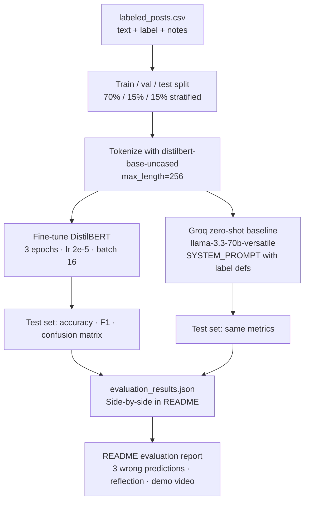

# TakeMeter — planning.md

> Complete this document before collecting or labeling data.
> Your label definitions, edge-case rules, and evaluation plan are what you'll use to direct AI tools (Claude, Groq, etc.) during annotation and analysis — the more specific they are, the less rework you'll do later.
> Your planning.md will be reviewed as part of your submission.
> Update it before starting any stretch features.

---

## Community

**Summary:** r/leagueoflegends is where LoL players talk patches, ranked, esports, and memes. I'm labeling posts as `analysis`, `hot_take`, `reaction`, or `question` depending on whether someone is actually explaining something, dropping a spicy take, sharing a personal moment, or asking for help. That split matters here because regulars can tell a real breakdown from a one-liner rant, and the flair tags don't help since almost everything is just "Discussion."

**Chosen community:** [r/leagueoflegends](https://www.reddit.com/r/leagueoflegends/)

**Why it works for this project:** Lots of text, lots of variety, and 200+ public posts are easy to grab from hot/new/top. You don't need vague "good post vs bad post" labels. The differences are obvious if you read the sub regularly.

**What the feed looks like:** Mechanics posts, nostalgia rants, rank celebration threads, esports news, climb advice. I read about 40 posts from old.reddit.com before locking in labels.

---

## Labels

Four labels. Each post or comment gets **exactly one** label based on the **text content**, not upvotes or flair.

### Label 1: `analysis`

**Definition:** The post explains, argues, or reports using game knowledge, mechanics, patch context, stats, links, or step-by-step reasoning — even if the conclusion is debatable.

**Example 1:**
> "I'm not sure if anyone has mentioned this, but I find it very odd that the way DFT refreshes its duration is by overwriting its current duration with a new duration. Since DFT have different durations for single target (4 seconds), AoE (2 seconds) and DoT spells (1 second), it is extremely likely you will accidentally overwrite a single target duration with an AoE duration resulting in damage loss… An example is on Smolder, who is a big user of DFT."

**Example 2:**
> "In the top 10 EUW, there are currently 8 midlaners. The reason is obvious, the most popular role gets autofilled the most, and hence get guaranteed aegis the most… My preferred solution is to remove this stupid system, but if they insist on doubling down on aegis then at least make aegis rate balanced across all roles at all ranks."

**Uncertain case:** "Why was the Ryze rework dumbed down?" — walks through old vs. new kit with ability descriptions. **Decision:** `analysis` because the post compares specific mechanics and asks a design question with evidence, not just venting.

---

### Label 2: `hot_take`

**Definition:** The post states a bold opinion, complaint, or nostalgia claim with little or no supporting evidence — the author asserts rather than argues, or blames teammates/meta without mechanical detail.

**Example 1:**
> "he was in a fine spot, you got rewarded for snowballing and playing well, now hes just overtuned and you can almost just slobber on the keyboard and win"

**Example 2:**
> "I know it got removed in 2019, still was my favorite mode in league. It was different than rift and when you'd get bored of 5vs5 you had a different option. Should be brought back especially with the new champions would be fun to see how it would play out."

**Uncertain case:** "This Game Has Been Homogenized For The Worse." — long nostalgia post listing old-season differences (duo top, old dragon timers). **Decision:** `hot_take` because claims are broad and rose-tinted without verifiable comparison or patch-level reasoning; reads as rant, not structured argument.

---

### Label 3: `reaction`

**Definition:** The post shares a personal moment, emotion, or low-stakes share without asking for advice — rank milestones, vents, screenshot flexes, polls about preferences, or "look what happened to me" posts.

**Example 1:**
> "Platinum :(((( … Finally climbing to something that isn't silver or gold… I know I'm still just as bad, but my god, I'm not playing anymore this season, I'm calling it a day."

**Example 2:**
> "This might be most rare thing I've ever encountered… Me and my team's Diana hitting the exact same damage in a 34 minute game for most damage dealt. It's not that cool overall, I get that, but I also just don't think I've ever encountered it before."

**Uncertain case:** "Hit plat now feel flat" — reflective essay on motivation after reaching a ranked goal. **Decision:** `reaction` because the core purpose is sharing personal feeling and asking "what's your why?" — not requesting gameplay advice or making a meta argument (even though it's longer than a one-liner).

---

### Label 4: `question`

**Definition:** The post's main purpose is to ask the community for advice, recommendations, or factual information — the author wants an answer, not to argue a take or celebrate a personal moment.

**Example 1:**
> "Who are you supposed to run Time Warp Tonic on?? Anyone??? Or is this rune merely a figment of our imagination."

**Example 2:**
> "A while ago I used to solo queue ranked a lot and the max I got was silver 1… Any suggestions on champs I should play or what lanes to pick? (I usually play mid and bot.)"

**Uncertain case:** "What is the tankiest passive in the game?" — title reads like a community poll, but the body describes a custom ADC the author built and asks which passive would fit. **Decision:** `question` because the author is soliciting input, not presenting a finished argument; label the **post text only**, not comments. If the body instead walked through passives with the author's own comparison and conclusion → `analysis`.

---

### Mutual exclusivity check

| If the post… | Label |
|--------------|-------|
| Cites stats, patch notes, ability interactions, or linked proof to make a case | `analysis` |
| Makes a strong claim with accusatory/nostalgic framing and no real evidence | `hot_take` |
| Shares a personal moment, vent, screenshot, or poll without primarily seeking advice | `reaction` |
| Asks for help, recommendations, champ picks, or factual answers from the community | `question` |

**Overlap resolved:** News posts with sourced context (e.g. Phantasm 4000 LP with patch reference and winrate) → `analysis`. Creator drama with u.gg links but mainly venting (i0ki smurf video) → `hot_take` if the body is opinion-heavy; → `analysis` only if the post's primary work is presenting verifiable evidence without the rant dominating. "Why was the Ryze rework dumbed down?" with ability-by-ability comparison → `analysis`, not `question`, because the author is arguing a design point, not asking for climb advice.

**Target distribution:** ~25% per label (roughly 50 examples each in a 200-example dataset). No label should exceed 70%.

---

## Hard Edge Cases

### Edge case type 1: One-stat "analysis" vs. hot take

**Ambiguous post:**
> "Sylas is overtuned — his win rate jumped 3% this patch and he wins every skirmish now."

Could be `analysis` ( cites a stat ) or `hot_take` ( cherry-picked stat + hyperbolic "wins every skirmish" ).

**Decision rule:** If removing the opinion framing leaves **one vague or cherry-picked stat** with no patch context, matchup discussion, or follow-up reasoning → `hot_take`. If the post compares multiple patches, cites specific ability changes, or builds an argument around the stat → `analysis`.

---

### Edge case type 2: Reflective personal posts vs. hot take complaints

**Ambiguous post:**
> "Top lane sucks… every loss came down to either my bot lane feeding or my jungler making a terrible call. I won my lane phase in every game."

Could be `reaction` ( vent ) or `hot_take` ( meta complaint about role impact ).

**Decision rule:** If the post **blames teammates/role design** as the main claim without self-review or mechanical detail → `hot_take`. If the primary purpose is asking "how do I carry?" or "what champs should I play?" → `question`. If the primary purpose is venting without seeking advice → `reaction`.

---

### Edge case type 3: `question` vs. `analysis`

**Ambiguous post:**
> "Why is K'Sante considered 'pro jailed'?" — followed by ability-by-ability breakdown and a request for others' views.

Could be `question` ( asking why ) or `analysis` ( structured kit walkthrough ).

**Decision rule:** If the post does substantive reasoning work (ability descriptions, matchup logic, patch context) and the question is rhetorical framing for an argument → `analysis`. If the post is mostly "I'm stuck / I'm new / what should I do?" with little reasoning → `question`.

---

### Edge case type 4: `question` vs. `reaction`

**Ambiguous post:**
> "Is T1 hosting all these teams for MSI? I saw G2 and KC scrimming there — just curious why."

Could be `question` ( factual curiosity ) or `reaction` ( casual share ).

**Decision rule:** If the post would still make sense rewritten as "Does anyone know…?" and the author wants information → `question`. If the post is sharing excitement or a personal observation with no real request for help → `reaction`.

---

### Documented difficult cases (fill in during annotation)

| # | Text snippet | Labels considered | Final label | Reason |
|---|--------------|-------------------|-------------|--------|
| 1 | *(add during Milestone 3)* | | | |
| 2 | *(add during Milestone 3)* | | | |
| 3 | *(add during Milestone 3)* | | | |

---

## Data Collection Plan

### Sources

| Source | What to collect | Approx. count |
|--------|-----------------|---------------|
| r/leagueoflegends **hot** + **new** self-posts | Full title + body for text posts | ~120 |
| **Top comments** on discussion threads | Substantive replies (50+ chars) | ~50 |
| **Patch / bug megathreads** | Mix of questions and mechanics notes | ~30 |
| **Esports / news threads** | Sourced reporting vs. spicy replies | ~20 |

**Collection method:** Manual copy-paste into a spreadsheet, then export to CSV. Use old.reddit.com for readable text. Public content only — no private Discord or login-gated threads.

**Text field format:**
- Self-posts: `title + "\n\n" + body` (truncate body at ~1500 chars if needed)
- Comments: comment body only
- Skip: pure link posts with no body, AutoModerator stickies, `[removed]`/`[deleted]`, non-English posts

### Target counts (200 total)

| Label | Target | Minimum before stopping |
|-------|--------|-------------------------|
| `analysis` | 50 | 45 |
| `hot_take` | 50 | 45 |
| `reaction` | 50 | 45 |
| `question` | 50 | 45 |

### If a label is underrepresented

1. After every 50 examples, check `value_counts()`.
2. If any label is **< 20%** of collected rows, pause and actively hunt that label:
   - `analysis` → patch notes threads, mechanics bug reports, K'Sante/pro-play breakdowns
   - `hot_take` → balance rants, nostalgia, creator drama, "X is broken" posts
   - `reaction` → rank milestones, vents, polls, screenshot shares
   - `question` → climb advice, champ/rune picks, newbie "where do I start?" posts
3. Do **not** dilute definitions to fill quotas — collect more examples instead.
4. Optional third column `notes` in CSV for borderline cases.

**Output file:** `data/labeled_posts.csv` with columns `text`, `label`, `notes` (optional).

---

## Evaluation Metrics

### Primary metrics (both fine-tuned model and Groq baseline)

| Metric | Why it matters for this task |
|--------|------------------------------|
| **Overall accuracy** | Headline comparison: did fine-tuning beat zero-shot on the same locked test set? On **4 classes**, random guessing ≈ 25%. |
| **Per-class precision, recall, F1** | Labels are subjective at boundaries; one class can look fine in accuracy while another collapses (e.g. everything predicted as `reaction`). **F1 is the most useful single number per class.** |
| **Confusion matrix** | Shows *directional* errors (e.g. `analysis` → `hot_take`), which maps directly to edge-case rules above. |

### Why accuracy alone is insufficient

- **`reaction` is often the majority class** in casual Reddit samples — high accuracy can mean "always guess reaction."
- **`analysis` vs. `hot_take`** is the hardest boundary; accuracy won't show whether the model learned evidence vs. tone.
- **Baseline comparison** requires the same metrics on the same test split — if fine-tuned accuracy is +0.05 but `hot_take` F1 is still 0.4, fine-tuning didn't solve the core problem.

### Secondary analysis (README / report)

- **3+ misclassified examples** with manual error analysis (labeling mistake vs. model limitation vs. ambiguous post).
- **Unparseable Groq responses** — if >10%, prompt format is broken; track count separately.
- **Reflection:** gap between intended decision boundaries and what the model actually learned (e.g. overfitting to post length or words like "patch").

### Stretch metrics (update if implemented)

| Stretch feature | Metric |
|-----------------|--------|
| Inter-annotator reliability | Cohen's κ or % agreement on 30+ shared examples |
| Confidence calibration | Accuracy binned by softmax confidence (90% vs. 60% buckets) |
| Error pattern analysis | Themed clusters in misclassifications (sarcasm, short posts, stat-one-liners) |

---

## Definition of Success

### Deployment usefulness

A useful TakeMeter classifier for r/leagueoflegends would reliably separate mechanics write-ups from rants and personal posts so a curation tool could surface higher-effort discussion. It does not need to judge whether a take is correct.

### Pass/fail checklist (objective)

At the end of the project, I will pull numbers from `evaluation_results.json`, the notebook's classification report, and the confusion matrix. **Success = all five "must pass" rows below.**

| # | Criterion | How to measure | Must pass | Stretch goal |
|---|-----------|----------------|-----------|--------------|
| 1 | Fine-tuned beats baseline | `finetuned_accuracy - baseline_accuracy` from Section 6 | ≥ **0.10** (10 pp) | ≥ 0.15 |
| 2 | Fine-tuned macro-F1 | `classification_report` → average of 4 per-class F1 scores | ≥ **0.60** | ≥ 0.70 |
| 3 | No collapsed class | Lowest per-class F1 among `analysis`, `hot_take`, `reaction`, `question` | ≥ **0.45** | All ≥ 0.60 |
| 4 | Baseline is usable | Parseable Groq responses / total test examples | ≥ **90%** | ≥ 95% |
| 5 | Errors are explainable | Largest off-diagonal count in confusion matrix / total wrong predictions | ≤ **40%** | ≤ 25% |

**How to compute row 5:** If the fine-tuned model gets 8 wrong on 30 test examples, and 4 of those are `analysis` predicted as `hot_take`, that pair is 4/8 = **50%** of errors → fails row 5. If the biggest confusion pair is ≤ 40% of all errors, pass.

**Random baseline:** 4 labels → random guessing ≈ **25%** accuracy. Both models should beat 25%; beating baseline by 10 pp is the real bar.

### Verdict rules (one sentence each)

| Outcome | Condition |
|---------|-----------|
| **Pass** | All 5 "must pass" rows met |
| **Partial pass** | Rows 1–3 met, but row 4 or 5 failed (usable model, fix prompt or accept noisy boundary) |
| **Fail** | Row 1 failed (fine-tuned ≤ baseline) **or** any per-class F1 < 0.40 **or** fine-tuned accuracy > 0.95 (likely too-easy labels or leakage) |

### Red flags (check before claiming success)

- Any single label is **>70%** of the full 200-example dataset → imbalance; success metrics don't count until re-collected.
- Fine-tuned accuracy high but one class F1 ≈ 0 → model is guessing the majority class; row 3 failed even if row 1 passed.
- Main error pair is **`reaction` ↔ `question`** → label definitions overlap; revisit edge cases, not just "train more."

### Expected hard boundary

Most errors should be **`analysis` ↔ `hot_take`**. That is acceptable if row 5 still passes. I will note in the README if that pair accounts for >50% of errors, since that matches the edge cases defined above.

### What I will not use as success

- Overall accuracy alone (can hide a dead class)
- "It feels right on a few examples" without test-set numbers
- Baseline worse than 25% without fixing the Groq prompt first

---

## Pipeline Overview

No agent loop — TakeMeter is a **train → evaluate → compare** pipeline in Colab.

**Notebook sections:** 1 Load CSV + label map → 2 Split + tokenize → 3 Fine-tune → 4 Evaluate fine-tuned → 5 Groq baseline → 6 Compare + export.

**Hyperparameter defaults (note in README if changed):** `distilbert-base-uncased`, 3 epochs, learning rate `2e-5`, batch size 16, max sequence length 256.

---

## Groq Baseline Prompt Plan

The baseline `SYSTEM_PROMPT` (notebook Section 5) will include:

1. Community name: r/leagueoflegends
2. One-sentence definition per label (copied from this doc)
3. One example post per label (from examples above)
4. Instruction: respond with **ONLY** the label string (`analysis`, `hot_take`, `reaction`, or `question`)
5. Decision hints for borderline cases (stat-one-liner → likely `hot_take`; personal milestone → `reaction`)

**Parsing rule:** Notebook matches output to `LABEL_MAP` keys; labels must appear exactly as spelled in CSV.

---

## Error Handling & Known Risks

| Stage | Failure mode | Response |
|-------|-------------|----------|
| CSV upload | Unknown label strings | Fix `LABEL_MAP` or CSV before training |
| Class imbalance | One label >70% | Collect more underrepresented examples; do not train until balanced |
| Groq baseline | Unparseable responses | Revise prompt; exclude `None` preds from baseline metrics; note count in README |
| Groq baseline | Rate limits / API errors | 0.1s delay between calls; retry failed rows once |
| Fine-tuning | OOM on T4 | Reduce batch size to 8 |
| Fine-tuning | Val accuracy flat / test worse than baseline | Check label consistency, leakage, epoch count; inspect wrong predictions |
| Evaluation | High accuracy, low F1 on one class | Majority-class collapse — add examples for weak class |
| Annotation | Inconsistent borderline labels | Re-read edge-case rules; fix notes column and relabel before training |

---

## Extra Credit Features

*(Update this section before starting each stretch feature.)*

| Feature | Status | Plan |
|---------|--------|------|
| Inter-annotator reliability (30+ examples) | Not started | Ask one friend to label 35 rows from a blind export; compare with Cohen's κ |
| Confidence calibration | Not started | Bin fine-tuned softmax scores; plot accuracy per bin in README |
| Error pattern analysis | Not started | Cluster misclassifications by length, sarcasm markers, label pair |
| Deployed interface | Not started | Simple Gradio script: text in → label + confidence out |

---

## AI Tool Plan

This project has no agent code to generate. AI tools help in three places: tightening labels before annotation, speeding up (not replacing) labeling, and surfacing error patterns after training. I will disclose all three in the README AI usage section.

---

### 1. Label stress-testing

**Tool:** Claude

**When:** Before collecting 200 examples, after label definitions and edge-case rules are written.

**What I'll do:** Paste my four label definitions and all edge-case decision rules from this doc into Claude and ask it to generate 8–10 synthetic r/leagueoflegends posts that sit on boundaries between two labels. I will request at least 2 posts per hard pair:

| Boundary pair | What the AI should generate |
|---------------|----------------------------|
| `analysis` ↔ `hot_take` | One-stat balance complaints; nostalgia posts with a single fact |
| `analysis` ↔ `question` | "Why is X pro jailed?" posts with partial kit breakdowns |
| `reaction` ↔ `hot_take` | Teammate-blame vents vs. systemic balance rants |
| `reaction` ↔ `question` | Casual curiosity posts vs. genuine advice requests |

**Prompt template:**
> Here are my label definitions and edge-case rules for r/leagueoflegends posts: [paste from planning.md]. Generate 10 posts that a careful annotator might disagree on. Include the pair each post straddles. Do not make them obvious — they should require my decision rules.

**Pass criteria:** I can assign exactly one label to every generated post using my written rules without guessing.

**If I fail:** Any post I can't label cleanly → update the definition or decision rule for that pair in this doc, re-run stress-testing on 3–5 new boundary posts, then start annotation.

**Status:** Initial taxonomy drafted with Claude after reading ~40 real posts. Full stress-test run planned before Milestone 3.

---

### 2. Annotation assistance

**Tool:** Groq `llama-3.3-70b-versatile` (same model as baseline, via a short script or Colab cell)

**Decision:** **Yes, I will pre-label** — but only as a draft. I will review and correct every row myself.

**Workflow:**
1. Collect unlabeled posts into a spreadsheet (`text` column only).
2. Run batches of 20–30 through Groq with a prompt copied from my label definitions (same content as the notebook `SYSTEM_PROMPT`).
3. Write Groq's suggestion into a temporary `prelabel` column.
4. Read each post, assign final `label`, and use `notes` to track changes.

**How I track pre-labeled rows (for README disclosure):**

| `notes` value | Meaning |
|---------------|---------|
| `prelabeled_groq; unchanged` | Groq label kept after review |
| `prelabeled_groq; corrected: hot_take→analysis` | I overrode Groq |
| *(empty)* | Labeled by hand from the start |

**Rules I won't break:**
- No bulk-accepting Groq labels without reading the post
- No pre-labeling the test set separately or peeking at test rows before the split (notebook splits after upload)
- Any row Groq couldn't parse gets labeled manually; noted as `prelabeled_groq; unparseable`

**What I'll override most often (based on expected Groq mistakes):**
- Stat-one-liners → Groq says `analysis`, I label `hot_take`
- Long vents with patch keywords → Groq says `hot_take`, I label `reaction`
- Help posts buried in personal context → Groq says `reaction`, I label `question`

**Estimated split:** ~60% pre-labeled batches, ~40% hand-labeled from the start (easier clear-cut examples collected directly).

---

### 3. Failure analysis

**Tool:** Claude

**When:** After fine-tuning (notebook Section 4), before writing the README evaluation report.

**Input I'll paste:**
- Confusion matrix (as text or screenshot description)
- All wrong predictions from Section 4: `text`, true label, predicted label, confidence
- My label definitions and edge-case rules

**Prompt template:**
> Here are misclassified test examples from my r/leagueoflegends classifier, with true vs predicted labels and confidence scores. Here are my label definitions: [paste]. Identify up to 5 systematic error patterns (not one-off mistakes). For each pattern, cite which examples support it and which label pair it affects.

**Patterns I'll ask the AI to look for:**

| Pattern | Example signal |
|---------|----------------|
| Stat-one-liner confusion | Number in text → model predicts `analysis`, true label `hot_take` |
| Length bias | Under 40 words → model defaults to `reaction` or `question` |
| Tone vs structure | Accusatory framing pushes `hot_take` even when post has patch detail |
| `reaction` ↔ `question` bleed | "Anyone else feel…?" vs "What champ should I play?" |
| High-confidence wrong | Confidence > 0.85 but wrong → possible annotation inconsistency |

**How I verify (AI does not go in README unchecked):**

1. For each AI-proposed pattern, count how many wrong preds match it (target: ≥3 examples or discard the pattern).
2. Re-read those examples against my decision rules — if *I* would label them differently, flag as **labeling noise**, not model failure.
3. Check confusion matrix direction matches the pattern (e.g. pattern claims `analysis`→`hot_take` but matrix shows the reverse → discard).
4. Only verified patterns go in the README; I'll note any AI-suggested pattern I rejected and why.

**Output:** 2–4 confirmed patterns in the evaluation report, plus 3 individual wrong-prediction deep dives (required by the rubric).

---

### AI usage disclosure (README)

I will document at least two specific instances. Planned entries:

1. **Label design + stress-testing** — Claude helped draft taxonomy and will generate boundary posts; I tightened `reaction` vs `question` split after review.
2. **Pre-labeling** — Groq pre-labeled ~120 rows; I corrected [TBD count] during review, tracked in `notes` column.
3. **Failure analysis** — Claude proposed error themes from wrong predictions; I verified counts before including in README.

## A Complete Interaction (Step by Step)

TakeMeter does not run live at query time during the project — this walkthrough describes **one test example** flowing through the finished pipeline.

**Example post (expected label: `analysis`):**
> "Deathfire Touch duration refreshing logic is very odd. Since DFT have different durations for single target (4 seconds), AoE (2 seconds) and DoT spells (1 second)… when you cast Q into W on Smolder, Q's 4 second duration gets overwritten by W's 2 second duration."

**Step 1 — CSV:** Post stored in `labeled_posts.csv` with `label=analysis`.

**Step 2 — Split:** Notebook assigns it to test set (stratified 15%) or train — locked before any model sees labels.

**Step 3 — Tokenize:** DistilBERT tokenizer truncates to 256 tokens.

**Step 4 — Fine-tuned inference:** Model outputs `analysis` with confidence ~0.82.

**Step 5 — Baseline:** Groq receives same text + `SYSTEM_PROMPT`; returns `analysis`.

**Step 6 — Evaluation:** Counted in accuracy/F1/confusion matrix; appears in README sample-classifications table with confidence.

**Alternate path — expected failure:** A one-stat Sylas complaint labeled `hot_take` in CSV but predicted `analysis` because the model overweighted the number "3%". Documented in README as a boundary error, not random noise.

---

## Checklist Before Data Collection

- [x] Community chosen with rationale
- [x] 4 labels defined with 2 examples each
- [x] Edge-case decision rules written
- [x] Data collection sources and per-label targets set
- [x] Evaluation metrics and success thresholds defined
- [x] AI Tool Plan covers stress-testing, annotation, and failure analysis
- [ ] 3 difficult annotation cases filled in table after labeling
- [ ] Stretch feature section updated if attempting extra credit
